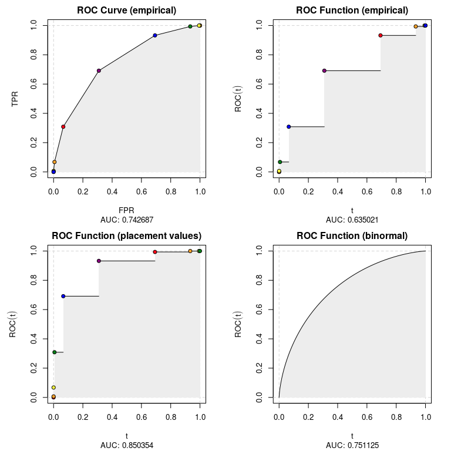
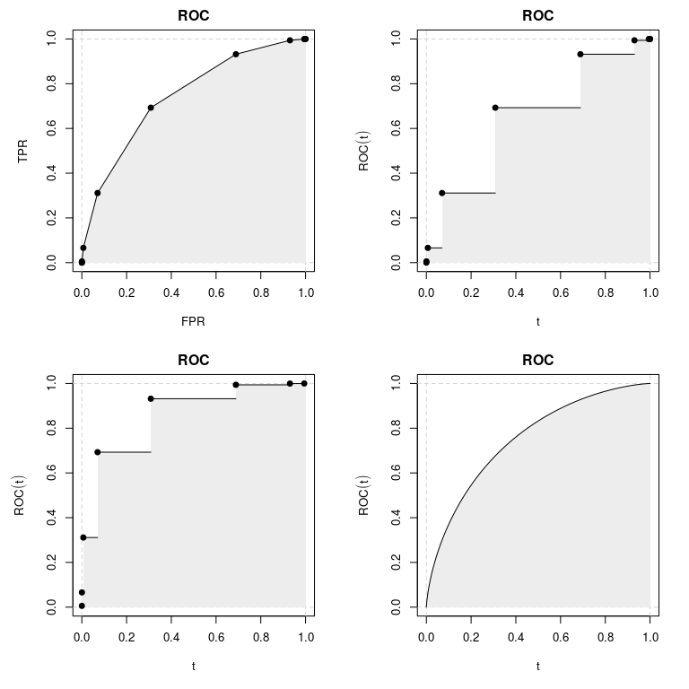
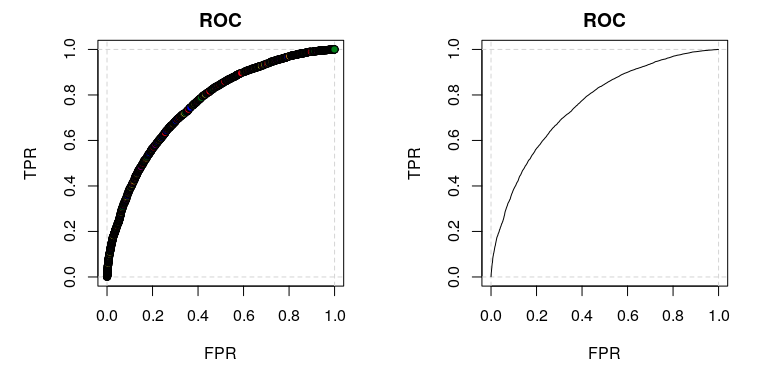

ROCket
================

## Intro

## Installation

``` r
# From GitHub
# install.packages("devtools")
devtools::install_github("da-zar/ROCket")
```

## Example

``` r
library(ROCket)
library(data.table)
```

### Data preparation

The easiest way to get started is to bring your dataset into a form
where you have for each predicted score the total number of observations
and the number of positive observations. Your dataset could look like
this:

``` r
head(data_agg)
#>    score totals positives
#> 1:     1   6197      3816
#> 2:     0   6194      2390
#> 3:     2   3088      2452
#> 4:    -1   3039       622
#> 5:     3    666       603
#> 6:    -2    694        56
```

You can now pass this data to the `rkt_prep` function in order to create
an object that will be later used for estimating ROC curves (possibly
with several different algorithms).

``` r
prep_data_agg <- rkt_prep(
  scores = data_agg$score, 
  positives = data_agg$positives, 
  totals = data_agg$totals)
```

It is not necessary to use an aggregated dataset. It’s also possible to
have each single observation in a separate row – then the `positives`
argument would be the regular indicator (numeric vector is required) for
positive observations and the `totals` argument would not be needed
(default is 1).

You can print the object, to get some information about the content:

``` r
prep_data_agg
#> .:: ROCket Prep Object 
#> Positives (pos_n): 10000 
#> Negatives (neg_n): 10000 
#> Pos ECDF (pos_ecdf): rkt_ecdf function 
#> Neg ECDF (neg_ecdf): rkt_ecdf function
```

or plot it:

``` r
plot(prep_data_agg)
```

<!-- -->

### ROC curves

``` r
show_methods()
#>    nr                            desc
#> 1:  1           ROC Curve (empirical)
#> 2:  2        ROC Function (empirical)
#> 3:  3 ROC Function (placement values)
#> 4:  4         ROC Function (binormal)
```

``` r
roc_list <- list()
for (i in 1:4){
  roc_list[[i]] <- rkt_roc(prep_data_agg, method = i)
}
```

``` r
par(mfrow = c(2, 2))
for (i in 1:4){
  plot(roc_list[[i]])
}
```

<!-- -->

### AUC

``` r
for (i in 1:4){
  print(auc(roc_list[[i]]))
}
#> [1] 0.7428745
#> [1] 0.6363024
#> [1] 0.8494465
#> [1] 0.7510745
```

### Plots with many points

``` r
head(data_agg_2)
#>     score totals positives
#> 1:  0.621      9         5
#> 2: -0.216      7         2
#> 3: -0.293      4         1
#> 4:  0.432      6         3
#> 5:  1.826      7         7
#> 6: -0.126      6         2
```

``` r
prep_data_agg_2 <- rkt_prep(
  scores = data_agg_2$score, 
  positives = data_agg_2$positives, 
  totals = data_agg_2$totals)
```

``` r
par(mfrow = c(1, 2))
plot(prep_data_agg_2)
#> Approximate plot using a sample of 1000 points.
plot(prep_data_agg_2, type = 'l')
#> Approximate plot using a sample of 1000 points.
```

<!-- -->
