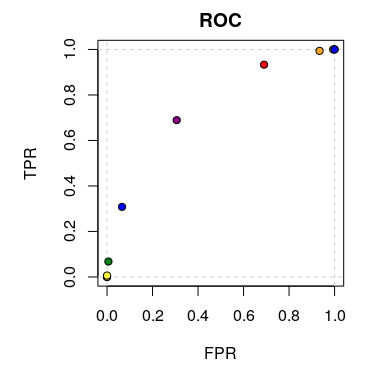
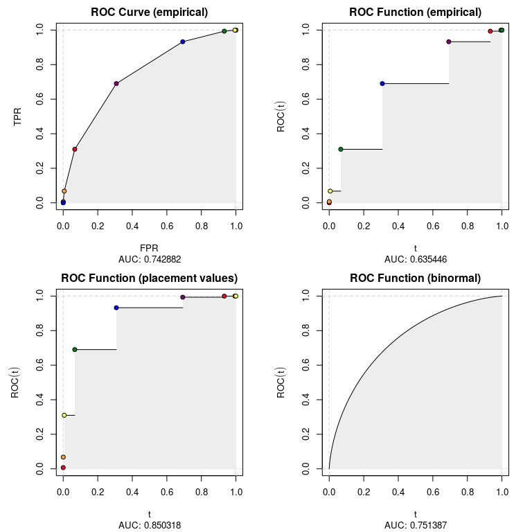

ROCket
================

## Intro

ROCket was primarily build for effective ROC estimation in the presence
of aggregated data, although it can also handle raw samples. Using
aggregated data can be beneficial when dealing with large datasets
containing categorical or discretized continuous features. Classifiers
can be trained much faster after reducing the size of the data by
calculating in advance all the sufficient statistics for each
constellation of feature values. The same is true for preparing ROC
curves\!

## Installation

``` r
# From GitHub
# install.packages("devtools")
devtools::install_github("da-zar/ROCket")
```

## Example

``` r
library(ROCket)
library(data.table)
```

### Data preparation

The easiest way to get started is to bring your dataset into a form
where you have for each predicted score the total number of observations
and the number of positive observations. Your dataset could look like
this:

``` r
nrow(data_agg)
#> [1] 10
head(data_agg)
#>    score totals positives
#> 1:     1  62687     38273
#> 2:     2  30087     24039
#> 3:     0  62423     24231
#> 4:    -2   6632       645
#> 5:    -1  30236      6059
#> 6:     3   6682      6135
```

You can now pass this data to the `rkt_prep` function in order to create
an object that will be later used for estimating ROC curves (possibly
with several different algorithms).

``` r
prep_data_agg <- rkt_prep(
  scores = data_agg$score, 
  positives = data_agg$positives, 
  totals = data_agg$totals
)
```

It is not necessary to use an aggregated dataset. It’s also possible to
have each single observation in a separate row – then the `positives`
argument would be the regular indicator (numeric vector is required) for
positive observations and the `totals` argument would not be needed
(default is 1).

You can print the object, to get some information about the content, or
plot it:

``` r
prep_data_agg
#> .:: ROCket Prep Object 
#> Positives (pos_n): 100000 
#> Negatives (neg_n): 100000 
#> Pos ECDF (pos_ecdf): rkt_ecdf function 
#> Neg ECDF (neg_ecdf): rkt_ecdf function
plot(prep_data_agg)
```

<!-- -->

### ROC curves

Estimates of the ROC curve can be calculated with the `rkt_roc`
function. It takes two arguments. The first one is the `rkt_prep`
object, which contains all the needed data, and the second one is an
integer saying which method of estimation to use. A list of implemented
methods can be retrieved with the `show_methods` function.

``` r
show_methods()
#>    nr                            desc
#> 1:  1           ROC Curve (empirical)
#> 2:  2        ROC Function (empirical)
#> 3:  3 ROC Function (placement values)
#> 4:  4         ROC Function (binormal)
```

In ROCket we distinguish two types of ROC curve representations:

1.  parametric curves – TPR and FPR are functions of a parameter (the
    score),
2.  functions – TPR is a function of FPR.

In the first case we estimate two functions, the x and y coordinates of
the ROC curve (FPR, TPR). These two functions are returned as a list. In
the second case the output is a regular function.

Let’s now calculate estimates of the ROC curve using all available
methods.

``` r
roc_list <- list()
for (i in 1:4){
  roc_list[[i]] <- rkt_roc(prep_data_agg, method = i)
}
```

The output of `rkt_roc` can be used to plot the ROC curve and calculate
the AUC.

``` r
par(mfrow = c(2, 2))
for (i in 1:4){
  plot(
    roc_list[[i]], 
    main = show_methods()[i, desc], 
    sub = sprintf('AUC: %f', auc(roc_list[[i]]))
  )
}
```

<!-- -->
